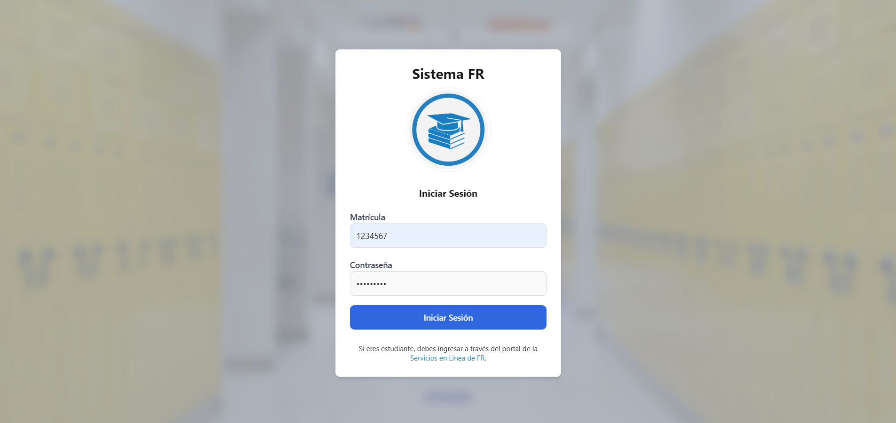
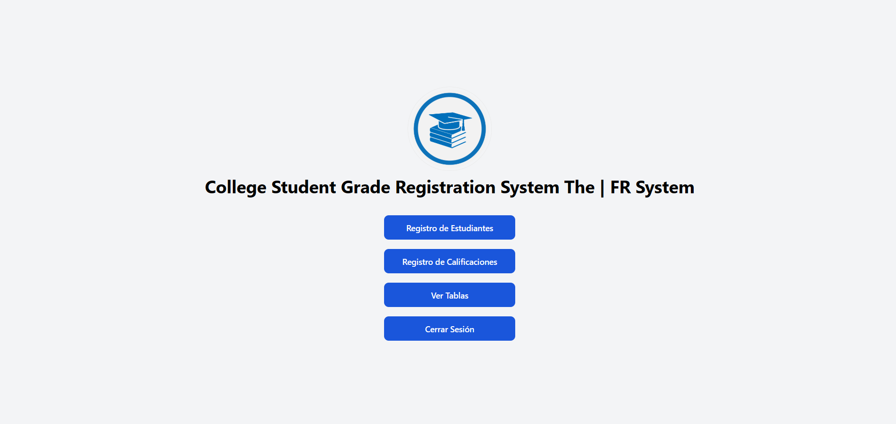
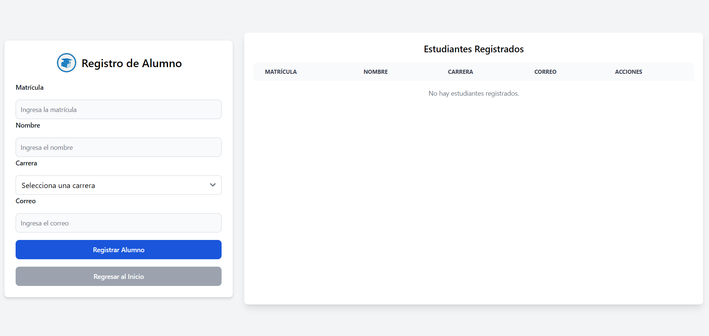
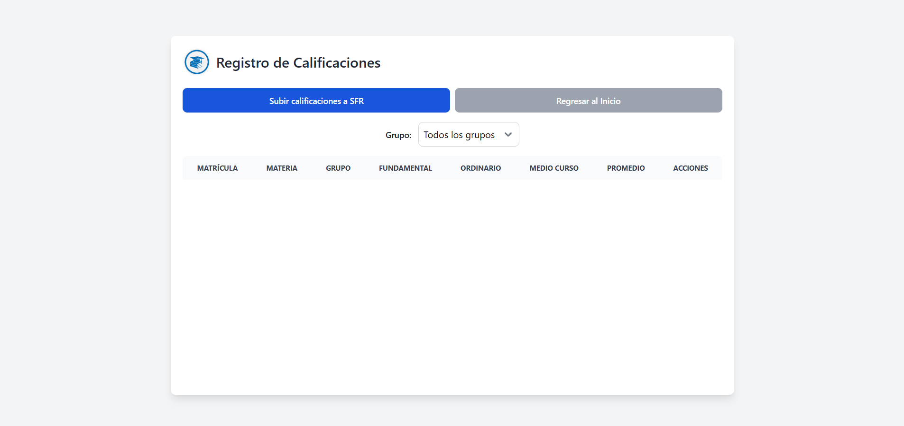

# Documentación de Sistema Escolar v1.0.0

## Descripción del Proyecto

El **Sistema Escolar** es una aplicación web desarrollada con el stack MERN (MongoDB, Express.js, React, Node.js) para gestionar información académica, como calificaciones de estudiantes, retroalimentación y notificaciones automáticas. Este sistema permite a los profesores proporcionar retroalimentación personalizada y enviar notificaciones por correo electrónico a los estudiantes de manera sencilla.

## Recursos Utilizados

El proyecto está desarrollado con las siguientes tecnologías y dependencias:

| Tecnología/Plugin     | Descripción                                 | URL                                   |
|-----------------------|---------------------------------------------|---------------------------------------|
| React.js              | Frontend interactivo y dinámico            | https://reactjs.org/                 |
| Node.js               | Servidor backend                           | https://nodejs.org/                  |
| Express.js            | Framework para Node.js                     | https://expressjs.com/               |
| MongoDB               | Base de datos NoSQL                        | https://www.mongodb.com/             |
| SweetAlert2           | Alertas y modales personalizados           | https://sweetalert2.github.io/       |
| Fetch API             | Solicitudes HTTP                           | https://developer.mozilla.org/       |

---

## Configuración Inicial

### Requisitos

1. **Node.js** (versión 16 o superior)
2. **MongoDB** (base de datos local o en la nube)

### Variables de entorno (.env)

Frontend
```sh
# URL de la API para el front
VITE_URL_BACKEND=http://localhost:5000/
VITE_STUDENT_URL=http://localhost:5000/api/students
VITE_GRADE_URL=http://localhost:5000/api/grades

# Esto se puede modificar al gusto 

# Matricula de solo numeros (7 digitos)
VITE_LOGIN_USER=2323232
# Contraseña de 8 caracteres (letras y numeros)
VITE_PASSWORD_USER=testing312

## En caso de no tener usuario el user es 1234567, y pass 12345678.
```

Backend
```sh
# URL para base de datos
MONGO_URI=mongodb://localhost:27017/sistemafrdatabase
```

### Imagenes





